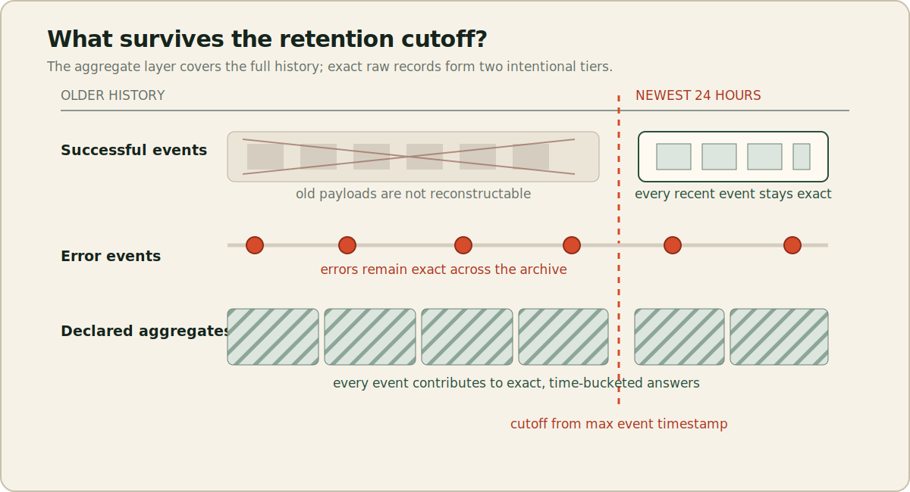
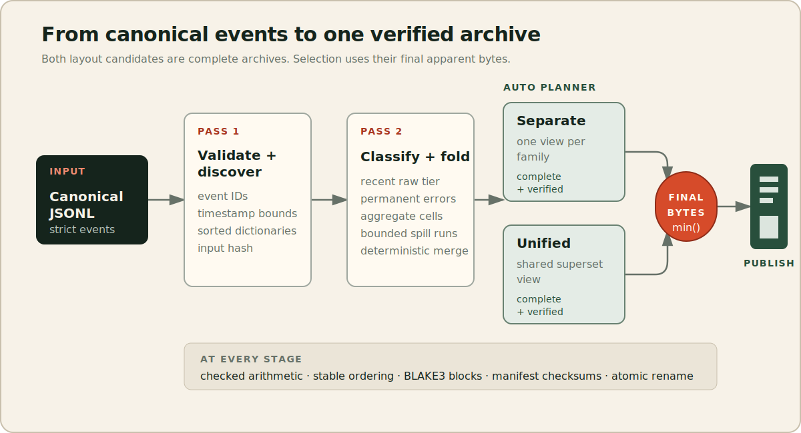
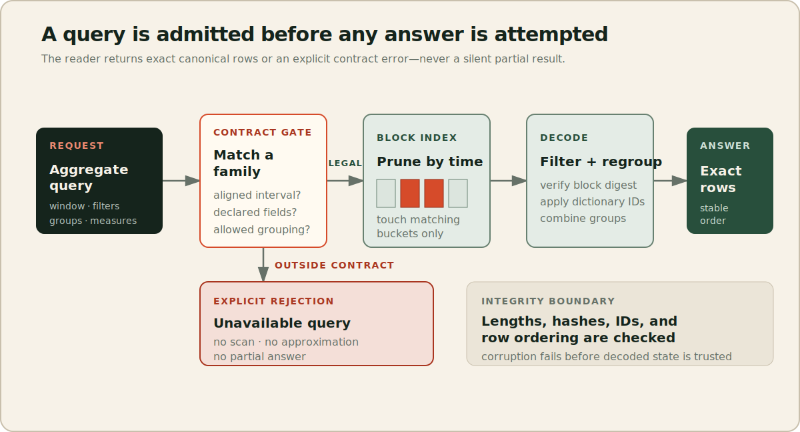

# TraceFold: Query-Preserving Compression for Tiered Telemetry Archives

**nearlynamed**  
**Technical report — not peer reviewed**

## Abstract

Telemetry archives are usually evaluated under a lossless contract: every stored event must remain reconstructable even when most historical use consists of a small set of aggregate questions. TraceFold studies a different, explicitly narrower contract. It retains recent canonical events and all events classified as errors, while replacing older successful payloads with deterministic, time-bucketed aggregate views for query families declared before encoding. Legal queries remain exact; unavailable raw history and undeclared query shapes fail explicitly.

The artifact implements this contract as a deterministic Rust batch archive with dictionary-encoded dimensions, independently compressed and checksummed view blocks, exact retained-raw tiers, and spill files for bounded aggregation. It compares the custom representation with canonical JSONL, gzip, Zstandard, raw Parquet, DuckDB, and a semantic Parquet baseline that stores the same materialized views and retained rows as TraceFold. Query instances are generated only after archive finalization and are compared with an independent raw-event oracle.

This publication contains 39 measured baseline rows over 3 corpora, of which 39 succeeded and 0 failed. It records 0 semantic mismatches. The measurements distinguish savings from the semantic contract, physical encoding, retained raw records, and layout selection. These findings support a conditional systems claim rather than a universal compression claim: query-preserving archives can be useful when their declared loss of raw recoverability matches the operational workload.

## 1. Introduction

Operational telemetry has an awkward lifetime. During an incident, engineers often need complete recent events, exact error payloads, and flexible inspection. Weeks later, the dominant questions are frequently repetitive: how many requests occurred per service, what was the latency distribution for an operation, how much traffic passed through a region, or how many errors carried a particular code? Conventional lossless compression treats these phases identically. It must retain enough information to reproduce every old successful body even when those bytes are no longer queried.

TraceFold asks whether the storage system can make the lifecycle distinction part of its public contract. The proposal is intentionally not a better general-purpose compressor. It trades historical payload recovery and open-ended querying for exact answers to a bounded family of aggregate questions. The trade is declared in a versioned manifest, embedded in every archive, enforced by the reader, and exposed in the benchmark. A request outside the contract is an error rather than a best-effort or silently incomplete result.

This framing matters because semantic reduction and physical compression are different sources of savings. Dropping an undeclared high-entropy body can dominate any gain from a new byte encoding. For that reason the primary format comparison is not only against raw Parquet or compressed JSONL. The artifact also constructs a view-equivalent Parquet archive containing the identical aggregate cells, hot rows, and permanent error rows. That baseline asks whether TraceFold's binary layout adds value after the semantic decision has already been made.

The work makes four concrete contributions:

1. A precise query-family and raw-retention contract with mechanically checked rejection boundaries.
2. A deterministic immutable archive with independently verifiable blocks, exact retained tiers, and a bounded-memory spill path.
3. A post-encode workload protocol that compares TraceFold, semantic Parquet, and independent raw oracles without revealing finite benchmark queries to the encoder.
4. A reproducible publication pipeline that preserves raw rows, failures, unfavorable comparisons, hashes, tables, and the narrative derived from them.

This is an artifact report, not a claim of peer-reviewed novelty. Its conclusions are bounded by the corpora, host, repetitions, query contract, and experiment stages represented in the published evidence.

## 2. Semantic contract

### 2.1 Canonical events

TraceFold accepts strict newline-delimited canonical JSON. Every event has a schema version, signed nanosecond timestamp, unique event identifier, service, event type, severity, and status. Optional trace identifiers, operations, error codes, model names, integer measures, scalar attributes, and an arbitrary JSON body carry additional information. Unknown top-level fields and floating-point measures are rejected so that schema drift and rounding cannot change aggregate answers silently.

Aggregation follows explicit null and overflow rules. `count` includes every selected event. Numeric sums, extrema, and fixed histograms ignore null values and carry a separate present count. Counts use checked unsigned integers and measures use checked signed integers. A null dimension is a real dictionary value, not an absent row, and therefore remains filterable and groupable.

The canonical layer separates source adaptation from archive semantics. The Loghub adapters preserve each original line in the body while deterministically mapping parsed fields into the schema. TraceFold promises exact recovery of retained canonical records, not the whitespace or byte layout of an upstream source line.

### 2.2 Raw retention

The default manifest retains all canonical events in the newest 24 hours and all events classified as errors for the full archive span. The cutoff is derived from the maximum event timestamp, so out-of-order input does not change the policy. Recent errors are stored once in the permanent error tier rather than duplicated in the recent tier. Both retained classes still contribute to aggregate views, allowing declared aggregate queries to cover the complete dataset.

This retained subset is never presented as complete historical raw data. The events command reports the retention class and cutoff, and old successful payload requests are unavailable by construction. In the published TraceFold rows, raw recoverability ranges from a small retained fraction to the fraction determined by the corpus's recent and error distribution; the corpus table below reports it directly.

*Figure 1. The raw-retention policy and aggregate coverage are separate layers. The cutoff changes raw recoverability, not the time span covered by legal aggregate queries.*

### 2.3 Preserved queries

A contract manifest declares named families, each with one to six dimensions, integer measures, fixed histogram bounds where applicable, a time-bucket width, and a retention policy. At runtime a legal aggregate query may choose a bucket-aligned half-open interval, equality or `IN` filters on declared dimensions, any grouping subset of those dimensions, and any subset of declared measures. The bucket remains an implicit grouping key, and output is sorted deterministically.

The manifest therefore preserves a parameterized query family rather than a finite answer sheet. Runtime values, time windows, groupings, and measure subsets are not known during encoding. Exactness means that every legal query produces the same canonical rows as an oracle scan of the full normalized event stream under the same bucket semantics.

### 2.4 Explicitly unavailable behavior

TraceFold rejects unaligned intervals, undeclared fields, numeric predicates other than time, joins, regex or substring search, full-text search, top-k ordering, quantiles, distinct counts, and cross-family combinations. It also cannot reconstruct old successful bodies. These are not implementation omissions hidden behind a generic query interface; they define the product boundary that makes semantic reduction possible.

This distinction prevents a common category error. TraceFold is not a drop-in replacement for a raw telemetry lake. It is appropriate only when operators can name the historical questions they must preserve and accept that other questions require another tier or are no longer answerable.

## 3. Archive design and implementation

### 3.1 Two-pass deterministic encoding

The encoder operates in two validated passes. The first pass validates canonical records, checks event-ID uniqueness, hashes canonical input, determines timestamp bounds and the hot cutoff, and gathers every value used by declared dimensions. Dictionary ID zero is reserved for null; all non-null values are sorted by UTF-8 bytes before IDs are assigned. This makes dictionary construction independent of input order and hash-map iteration.

The second pass classifies retained rows and updates aggregate cells for older and retained events alike. The automatic planner independently materializes the separate and unified candidates when both are legal, verifies them, and retains the smaller complete archive. Explicit layout controls remain available for ablation. Aggregation uses checked arithmetic and a configurable memory estimate. When the estimate exceeds its budget, maps are sorted into deterministic spill runs. Finalization merges runs by bucket and dictionary IDs, combining identical keys before view blocks are written.

The archive is assembled in a sibling temporary directory and published by rename only after verification succeeds. Repeated encodes of the same canonical input and contract are byte-identical. Existing output requires explicit replacement, and failed encodes do not leave a partially published archive.

*Figure 2. Automatic layout selection compares finalized, verified archives rather than estimating the size of isolated view files.*

### 3.2 Physical representation

An archive contains metadata, the exact contract, checksums, compressed dimension dictionaries, one or more `.tfv` aggregate views, and binary recent/error tiers. Each view begins with a guarded header and schema, followed by a fixed block index and independently Zstandard-compressed data blocks. Rows are globally ordered by bucket and dimension IDs. Buckets are delta encoded; IDs and counts use variable-length integers; signed measures use ZigZag encoding; and every measure stores only the state needed by its declared operation.

Retained canonical events use indexed binary blocks rather than repeating JSON field names. Timestamp deltas, optional-field bitmaps, packed enums, dictionary references, signed integers, attributes, and canonical JSON bodies reconstruct the exact event values exposed by the CLI. Every retained block records timestamp bounds, lengths, counts, and a BLAKE3 digest.

Blocks end at a row or uncompressed-byte threshold. Their indexes record bucket bounds, offsets, compressed and uncompressed lengths, row counts, and BLAKE3 digests. A query can therefore prune unrelated time blocks before decompression. The decoder validates lengths, allocation bounds, dictionary references, row ordering, hashes, and aggregate invariants before trusting data.

### 3.3 Query execution and integrity

The reader first matches a request to an embedded family and rejects it if any field, measure, predicate, grouping, or interval lies outside the contract. It then uses the block index to select bucket ranges, decodes candidate rows, applies dictionary filters, and regroups only when the requested grouping is a subset of the stored view. The result serializer uses stable ordering so oracle comparisons reduce to byte equality rather than approximate numeric comparison.

The verifier checks every declared archive path, byte length, checksum, view bound, dictionary reference, and ordering invariant. Tests also cover truncation and tampering. Forced-spill and no-spill encodes are compared for byte identity and answer equality, exercising a path that small default runs would otherwise miss.

*Figure 3. Query execution has a hard admission boundary: accepted requests return exact, stably ordered rows; unavailable requests fail explicitly.*

## 4. Research questions

The full research plan asks six questions. **RQ1** measures storage relative to lossless JSONL, Zstandard, raw Parquet, DuckDB, and semantic Parquet. **RQ2** measures whether pre-aggregation and block pruning improve or regress query latency. **RQ3** asks how retention duration and bucket width move the fidelity frontier. **RQ4** tests scale, cardinality, entropy, correlation, and error rate. **RQ5** isolates custom encoding from materialized-view semantics. **RQ6** measures ingestion time, memory, and temporary disk cost.

The published evidence covers the primary comparison and codec/layout ablations for the listed corpora, together with correctness and rejection behavior. Any frontier without measured rows remains outside the supported findings. A larger archive, slower query, timeout, or resource failure is a valid result and remains visible.

## 5. Experimental methodology

### 5.1 Corpora and size cap

The acquisition ceiling is 1,073,741,824 bytes per downloaded public artifact or generated canonical source. The largest observed source artifact was 57,489,019 bytes. Normalization is allowed to expand beyond that cap; the largest normalized stream was 2,004,094,557 bytes. This distinction is important for BGL, whose compact download expands substantially when each line becomes a strict canonical event.

| Corpus | Records | Source bytes | Extracted bytes | Canonical bytes | TraceFold raw recoverability |
| --- | ---: | ---: | ---: | ---: | ---: |
| loghub-bgl | 4,747,963 | 57,489,019 | 743,185,031 | 2,004,094,557 | 7.35% |
| loghub-zookeeper | 74,380 | 459,911 | 10,426,438 | 29,758,646 | 6.22% |
| smoke-standard-10000 | 10,000 | 4,637,593 | 4,637,593 | 4,637,593 | 4.25% |

The synthetic smoke corpus is generated deterministically. Public validation uses the ZooKeeper and BGL datasets from [Loghub](https://doi.org/10.1109/ISSRE59848.2023.00071). Source downloads are locked by size and SHA-256 in the corpus manifest. Raw public data and large normalized intermediates are not redistributed in Git; the publication retains only compact benchmark rows and their hashes.

### 5.2 Baselines and fairness

Every baseline receives the same normalized canonical JSONL. Raw-preserving baselines are uncompressed JSONL, gzip level 6, Zstandard levels 3 and 9, raw Parquet/Zstandard, and a DuckDB table. Stream formats are queried by decompression plus an oracle scan; Parquet and DuckDB use equivalent SQL.

The semantic baseline, `views-parquet-zstd`, computes the same aggregate cells and retains the same recent and error rows as TraceFold, then stores and queries those views using Parquet and DuckDB. It is the central control for RQ5. Comparing TraceFold only with raw Parquet would conflate a changed information contract with an encoding improvement.

Archive bytes include the components required to answer the declared contract. Normalization time is outside encoding time. The JSONL row is a reference to the already materialized canonical stream, so its near-zero “encode” value is not a comparable transformation cost and should not be read as throughput superiority.

### 5.3 Anti-cheating and semantic verification

The encoder sees the manifest but never the instantiated benchmark queries. Canonical data and archive hashes are frozen first. A separate seeded workload generator then creates 200 legal queries—distributed across declared families, filter shapes, grouping subsets, measure subsets, and aligned intervals—and 20 deliberately unavailable queries. Legal results are compared with the exact raw-event oracle; illegal requests must produce the expected contract rejection.

The rows report 0 mismatches and preserve structured failures rather than suppressing them. This protocol tests a runtime family, not a finite list of answers embedded after seeing the benchmark.

### 5.4 Timing and host

Published times are wall-clock measurements from Intel(R) Core(TM) i7-10700K CPU @ 3.80GHz, 16 logical cores, 31.3 GiB reported memory, wsl2. Query values represent a batch of generated queries, not a single request. Process-cold execution starts a new process but does not claim a disk-cold operating-system cache. Each reported corpus/baseline cell contains between 1 and 1 measured attempt(s). These values describe this run and do not support confidence intervals or claims about small differences.

When peak RSS or spill measurements are absent, the report does not infer them. Missing evidence remains missing rather than being filled with estimates.

## 6. Results

The primary generated table follows. Archive size is apparent bytes. Compression is relative to canonical JSONL. Encode and query values are milliseconds for the measured attempt.

| Dataset | Baseline | Archive bytes | Compression | Encode (ms) | Query batch (ms) |
| --- | --- | ---: | ---: | ---: | ---: |
| loghub-bgl | duckdb-raw | 342,896,640 | 5.84× | 8873.73 | 8755.09 |
| loghub-bgl | gzip-6 | 95,423,564 | 21.00× | 7701.68 | 9431.68 |
| loghub-bgl | jsonl | 2,004,094,557 | 1.00× | 0.00 | 9074.82 |
| loghub-bgl | parquet-raw-zstd | 80,953,926 | 24.76× | 2171.08 | 8992.31 |
| loghub-bgl | tracefold-auto-zstd9 | 4,698,677 | 426.52× | 47051.45 | 2593.74 |
| loghub-bgl | views-parquet-zstd | 6,426,634 | 311.84× | 651.71 | 10041.48 |
| loghub-bgl | zstd-3 | 100,358,115 | 19.97× | 2587.71 | 9384.32 |
| loghub-bgl | zstd-9 | 73,285,895 | 27.35× | 14023.70 | 9541.50 |
| loghub-zookeeper | duckdb-raw | 5,517,312 | 5.39× | 339.17 | 2965.18 |
| loghub-zookeeper | gzip-6 | 939,710 | 31.67× | 82.11 | 422.07 |
| loghub-zookeeper | jsonl | 29,758,646 | 1.00× | 0.00 | 416.82 |
| loghub-zookeeper | parquet-raw-zstd | 642,771 | 46.30× | 64.42 | 3121.74 |
| loghub-zookeeper | tracefold-auto-zstd9 | 53,964 | 551.45× | 727.51 | 841.49 |
| loghub-zookeeper | views-parquet-zstd | 210,671 | 141.26× | 106.77 | 3292.33 |
| loghub-zookeeper | zstd-3 | 978,507 | 30.41× | 31.55 | 419.16 |
| loghub-zookeeper | zstd-9 | 693,507 | 42.91× | 176.39 | 426.53 |
| smoke-standard-10000 | duckdb-raw | 798,720 | 5.81× | 144.32 | 1478.43 |
| smoke-standard-10000 | gzip-6 | 459,351 | 10.10× | 45.33 | 206.86 |
| smoke-standard-10000 | jsonl | 4,637,593 | 1.00× | 0.00 | 205.08 |
| smoke-standard-10000 | parquet-raw-zstd | 250,620 | 18.50× | 12.39 | 1542.51 |
| smoke-standard-10000 | tracefold-auto-zstd9 | 218,127 | 21.26× | 360.29 | 810.71 |
| smoke-standard-10000 | views-parquet-zstd | 1,377,243 | 3.37× | 76.46 | 1695.59 |
| smoke-standard-10000 | zstd-3 | 456,689 | 10.15× | 15.88 | 209.22 |
| smoke-standard-10000 | zstd-9 | 390,177 | 11.89× | 65.37 | 205.24 |

### 6.1 Per-corpus interpretation

**loghub-bgl.** TraceFold occupied 4,698,677 bytes. It was 26.9% smaller than semantic Parquet (6,426,634 bytes). It was 94.2% smaller than raw Parquet (80,953,926 bytes). It was 93.6% smaller than Zstandard-9 JSONL (73,285,895 bytes). Its query batch took 2593.74 ms versus 10041.48 ms for semantic Parquet, while encoding took 47051.45 ms versus 651.71 ms. Its query batch took 2593.74 ms versus 8992.31 ms for raw Parquet, while encoding took 47051.45 ms versus 2171.08 ms.

**loghub-zookeeper.** TraceFold occupied 53,964 bytes. It was 74.4% smaller than semantic Parquet (210,671 bytes). It was 91.6% smaller than raw Parquet (642,771 bytes). It was 92.2% smaller than Zstandard-9 JSONL (693,507 bytes). Its query batch took 841.49 ms versus 3292.33 ms for semantic Parquet, while encoding took 727.51 ms versus 106.77 ms. Its query batch took 841.49 ms versus 3121.74 ms for raw Parquet, while encoding took 727.51 ms versus 64.42 ms.

**smoke-standard-10000.** TraceFold occupied 218,127 bytes. It was 84.2% smaller than semantic Parquet (1,377,243 bytes). It was 13.0% smaller than raw Parquet (250,620 bytes). It was 44.1% smaller than Zstandard-9 JSONL (390,177 bytes). Its query batch took 810.71 ms versus 1695.59 ms for semantic Parquet, while encoding took 360.29 ms versus 76.46 ms. Its query batch took 810.71 ms versus 1542.51 ms for raw Parquet, while encoding took 360.29 ms versus 12.39 ms.

### 6.2 Correctness and rejection behavior

Across the published rows, all successful implementations returned oracle-equivalent outputs for their legal workload and TraceFold explicitly rejected the generated illegal workload. The aggregate mismatch count is 0. There were 0 recorded failed baseline attempts. Zero recorded failures should not be confused with exhaustive validation: corruption, determinism, null behavior, forced spill, and schema boundaries are exercised by unit and integration tests, while the published benchmark covers the three listed corpora.

### 6.3 What the custom format adds

The semantic Parquet comparison isolates the information-policy benefit from physical representation. Per-corpus differences reported above show whether TraceFold's integer, dictionary, retained-event, and block layouts add value after both systems are allowed to store the same materialized information. A win on these view shapes is evidence for this workload, not proof that a custom representation dominates mature columnar storage generally.

Query batches often favor the pre-aggregated representations over raw DuckDB or Parquet scans, but stream scans can remain competitive on small corpora. TraceFold also pays a visible encoding cost for validation, dictionary construction, aggregate maintenance, hashing, and block construction. A deployment must value repeated historical queries enough to amortize that batch cost.

## 7. Discussion

### 7.1 The principal saving is semantic

The central engineering lesson is that information policy matters more than codec branding. If old successful bodies contain most of the entropy, no lossless layout can simply omit them. TraceFold becomes small because the manifest says they are no longer reconstructable. The semantic Parquet baseline makes this visible: a conventional columnar format can realize much of the same benefit once it is allowed to store identical materialized views instead of raw events.

This is useful even when the custom format loses. It suggests that teams can test the retention/query contract with existing analytical tooling before accepting a specialized archive. `.tfv` is justified only where its measured size, block pruning, determinism, or simple embedded reader outweighs the operational maturity of Parquet and DuckDB.

### 7.2 Operational fit

TraceFold fits immutable batch tiers: a daily or weekly canonical partition can be closed, folded, verified, and moved to a cheaper historical tier while a separate hot system serves unrestricted recent search. Error rows remain available because incidents often need their exact bodies. Declared families should come from durable operational requirements—service volume, latency, traffic, model usage, and error volume—not from benchmark convenience.

The design is a poor fit when analysts frequently invent new dimensions, conduct forensic text search over old successes, require distinct counts or quantiles, or cannot reliably classify error events during normalization. In those cases raw-preserving storage, or a dual-tier architecture that keeps raw history elsewhere, is the safer contract.

### 7.3 Privacy is not guaranteed deletion

Discarding old bodies may reduce retained sensitive payloads, but TraceFold is not a redaction or secure-deletion system. Recent and error tiers can still contain secrets. Declared dimensions and dictionaries remain indefinitely, and upstream copies may exist. Archives therefore require the same access control and threat model as other telemetry stores.

## 8. Threats to validity

**Workload selection.** The author selects the query families. They may align unusually well with the data or omit real investigative needs. Generating query instances after encoding prevents finite-answer cheating but does not remove this selection bias.

**Dataset representativeness.** The synthetic smoke corpus is small, and Loghub system logs are not full modern distributed traces. BGL and ZooKeeper validate scale and adapter behavior, but their field distributions, message bodies, and error labels may not represent production OpenTelemetry workloads.

**Time semantics.** Exactness holds only after accepting the declared bucket width and aligned intervals. A one-minute aggregate is not an exact substitute for a one-second question. Conclusions about precision are limited to bucket widths represented by measured rows.

**Error classification.** Permanent error recovery depends on adapter normalization. Misclassified source lines can move events into or out of the retained error tier. The adapters preserve original lines in canonical bodies and track parse warnings, but this does not prove that labels capture every operationally important event.

**Engine asymmetry.** TraceFold uses a purpose-built Rust reader; Parquet and DuckDB use DuckDB; compressed streams use a scan oracle. These systems have different startup costs, vectorization strategies, and cache behavior. The semantic Parquet comparison narrows the information-policy gap but not the implementation gap.

**Host and repetition.** Measurements come from Intel(R) Core(TM) i7-10700K CPU @ 3.80GHz, 16 logical cores, 31.3 GiB reported memory, wsl2. Each reported corpus/baseline cell contains between 1 and 1 measured attempt(s). The snapshot lacks repeated trials, bootstrap confidence intervals, peak RSS, CPU time, bytes-read counters, and multiple machines. Process-cold is not disk-cold. Timing differences, especially small ones, should not be generalized.

**Evidence coverage.** Experiment stages without successful rows establish no storage, latency, or memory result. Resource failures and empty frontiers are retained rather than extrapolated.

## 9. Limitations

TraceFold is immutable and batch-oriented. It has no live ingestion, concurrent writers, background compaction, SQL parser, OTLP service, encryption, or redaction. It does not support joins, regex predicates, arbitrary numeric ranges, quantiles, distinct counts, top-k, full-text search, or reconstruction of old successful events. The fixed dimension and measure vocabulary must be known before encoding.

The automatic planner evaluates separate and unified layouts, but both may be large when declared dimensions have high cardinality or weak correlation. Spill files bound the active aggregation estimate, while real memory and temporary-disk conclusions remain limited to measured rows. The implementation prioritizes deterministic, defensive decoding over streaming ingestion.

The publication site is an executable technical report, not peer review. Its raw result rows make the claims inspectable, but reproducibility on another host may produce different timing while preserving correctness and archive bytes.

## 10. Related work

TraceFold relies on [Zstandard](https://doi.org/10.17487/RFC8878) for block and stream compression rather than proposing a new entropy coder. Raw columnar comparisons use [Apache Parquet](https://parquet.apache.org/docs/), whose typed columns and page encodings are a strong baseline for reconstructable canonical events. [DuckDB](https://duckdb.org/why_duckdb) supplies an embeddable analytical engine for raw and semantic Parquet queries.

The semantic design is closer to materialized views and data cubes than to conventional lossless compression. Foundational work on selecting and implementing data cubes, including [Harinarayan, Rajaraman, and Ullman](https://doi.org/10.1145/233269.233333), studies the trade between stored aggregate cells and query cost. TraceFold fixes a small declared family rather than optimizing an arbitrary cube lattice, and combines those views with exact hot/error raw tiers.

[OpenTelemetry](https://opentelemetry.io/docs/specs/otel/) provides the contemporary context for traces, metrics, logs, attributes, and semantic conventions. TraceFold does not ingest OTLP directly; its canonical schema is a deliberately smaller adapter boundary. [Loghub](https://doi.org/10.1109/ISSRE59848.2023.00071) supplies reproducible public log corpora for the current validation. The checked-in bibliography records these sources and stable identifiers.

## 11. Reproducibility and provenance

The repository locks Rust, Python, and JavaScript dependencies. `scripts/reproduce-smoke.sh` rebuilds a bounded correctness publication; `scripts/reproduce-public.sh` fetches pinned Loghub sources, validates their size and hash, normalizes them, runs the public comparison, regenerates tables/charts/paper, and builds the site. Large corpora, normalized streams, archives, and spill files remain outside Git.

The benchmark implementation commit recorded by this publication is `4a96a5308c8d9147eccab495cfb78c8d461856db`. The evidence snapshot is `6666bcc18a5b6627da0824ac3e5536aa95287e538653f16ea89b7973e17dc937`. Published raw evidence consists of `raw/public.jsonl` (`sha256:77216b5d7a0cd26af01019a485d296f8fe1e72c24bea12d01efe4539a481c11f`), `raw/smoke.jsonl` (`sha256:4b310f762438dbddeb1d7c09c1154f0f3c0387957dcd787afdab62a2f253feae`). Site synchronization recomputes every SHA-256 and requires the same snapshot identifier across the summary, methodology, paper, and publication manifest.

To audit a quantitative claim, locate the corresponding corpus/baseline row in `results/site-data/raw`, confirm its schema and hashes, compare it with `results/site-data/tables/primary.json`, and regenerate this report. The static site does not fetch analytics or mutate the result set.

## 12. Conclusion

TraceFold demonstrates an enforceable way to exchange historical raw recoverability for exact answers to declared telemetry queries. The implemented archive is deterministic, checksummed, explicit about unavailable behavior, and verified against post-encode oracle workloads. The measurements quantify storage, query latency, encoding cost, layout choice, and view-equivalent Parquet comparisons without extending the claim beyond the published rows.

The supported conclusion is therefore conditional. TraceFold is promising for immutable telemetry tiers whose future questions are stable and whose old successful payloads are genuinely disposable. It is not a general telemetry database, a universal Parquet replacement, or evidence that raw history is unnecessary. The next useful work is not to add features indiscriminately, but to complete the retention, precision, cardinality, error-rate, layout, seed, memory, and multi-host experiments and then decide which extensions the evidence justifies.
